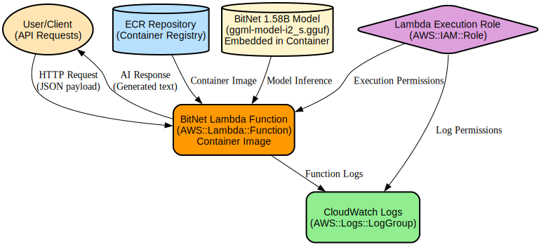

# BitNet Lambda: A Containerized Language Model Inference Server

BitNet Lambda is a containerized inference server that provides fast and efficient language model capabilities through a RESTful API. It leverages Microsoft's BitNet model architecture to deliver text completion and generation services with optimized performance using Docker containerization.

The project provides a complete deployment pipeline that handles model downloading, container building, and local deployment. It features a multi-stage Docker build process that optimizes the final image size while maintaining high performance through static linking and runtime optimizations. The server exposes an HTTP API on port 8080 that accepts completion requests and supports configurable parameters like context size and thread count.

## Repository Structure
```
.
├── App/
│   ├── Dockerfile          # Multi-stage Docker build configuration for BitNet server
│   └── server.py          # Python server script managing BitNet process lifecycle
└── scripts/
    ├── 1-initialize.sh    # Downloads BitNet code and model files
    ├── 2-build.sh        # Builds Docker image with BitNet server
    ├── 3-deploy.sh       # Deploys container locally with model mounting
    └── 4-test.sh         # Test script for API validation
```

## Usage Instructions
### Prerequisites
- Docker Engine 20.10.0 or later
- Git
- curl
- 8GB+ RAM recommended
- 10GB+ free disk space
- Internet connection for model download

### Installation

1. Clone the repository and initialize:
```bash
git clone <repository-url>
cd bitnet-lambda
chmod +x scripts/*.sh
./scripts/1-initialize.sh
```

2. Build the Docker image:
```bash
./scripts/2-build.sh
```

3. Deploy the container:
```bash
./scripts/3-deploy.sh
```

### Quick Start

1. After deployment, the server will be available at `http://localhost:8080`

2. Test the API with a simple completion:
```bash
curl -X POST http://localhost:8080/completion \
  -H 'Content-Type: application/json' \
  -d '{"prompt": "Hello, world", "n_predict": 10}'
```

### More Detailed Examples

1. Generate a short poem:
```bash
curl -X POST http://localhost:8080/completion \
  -H 'Content-Type: application/json' \
  -d '{"prompt": "Write a short poem about AI", "n_predict": 30}'
```

2. Run the test script for multiple examples:
```bash
./scripts/4-test.sh
```

### Troubleshooting

Common Issues:

1. Docker Image Build Fails
- Error: "BitNet code not found in temp/BitNet"
  - Solution: Run `./scripts/1-initialize.sh` first
- Error: Memory allocation issues
  - Solution: Ensure at least 8GB of RAM is available

2. Server Won't Start
- Error: Model file not found
  - Solution: Verify model exists in `temp/models/BitNet-b1.58-2B-4T/`
  - Run `./scripts/1-initialize.sh` to download the model

3. Performance Issues
- Enable debug logging:
  ```bash
  docker logs bitnet-lambda-container
  ```
- Monitor container resources:
  ```bash
  docker stats bitnet-lambda-container
  ```

## Data Flow
The BitNet Lambda server processes text completion requests through a REST API, transforming input prompts into generated text using the BitNet language model.

```ascii
Client Request -> HTTP API (8080) -> Python Server -> BitNet Process -> Model Inference -> Response
     |                                    |               |                    |
     +-> JSON Prompt                      +-> Process     +-> Load Model      +-> Generated Text
         Parameters                           Management      Apply Settings      JSON Response
```

Key Component Interactions:
1. Client sends POST request to `/completion` endpoint with prompt and parameters
2. Python server manages BitNet process lifecycle and signal handling
3. BitNet process loads model and performs inference
4. Server streams output back to client as JSON response
5. Container handles graceful shutdown on SIGTERM/SIGINT
6. Model files are mounted from host for persistence
7. Multi-threading handles separate stdout/stderr streams

## Infrastructure



Docker Container Resources:
- Base Image: python:3.9-slim
- Exposed Ports: 8080
- Mounted Volumes: 
  - `/app/models/BitNet-b1.58-2B-4T/` -> `temp/models/BitNet-b1.58-2B-4T/`
- Environment:
  - Python 3.9 runtime
  - libomp5 for parallel processing

Build Infrastructure:
- Multi-stage build process
- Builder stage: python:3.9-bullseye with build tools
- Runtime stage: Optimized slim image
- Static linking for improved portability

## Deployment

Prerequisites:
- Docker environment
- Model files downloaded
- 8GB+ RAM
- Port 8080 available

Deployment Steps:
1. Initialize: `./scripts/1-initialize.sh`
2. Build: `./scripts/2-build.sh`
3. Deploy: `./scripts/3-deploy.sh`
4. Verify: `./scripts/4-test.sh`

Monitor deployment:
```bash
docker logs -f bitnet-lambda-container
```

Stop deployment:
```bash
docker stop bitnet-lambda-container
```